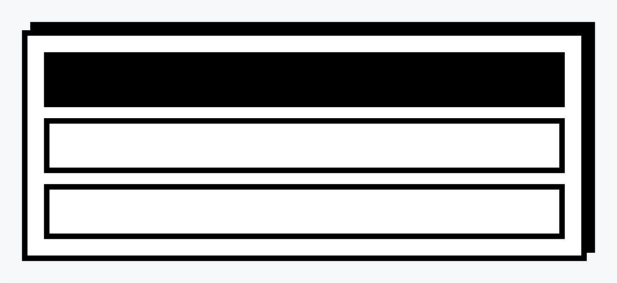
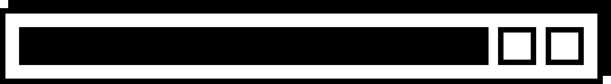

# B ❐ X L

Layout primitives for the [styled component](https://www.styled-components.com) age.

## Installation

```shell
$ npm i boxl styled-components
```
>Built with [styled components](https://www.styled-components.com) which is required as a peer dependency

## Usage

Create components with the `boxl` function passing default props and styling.

```jsx
import * as React from "react";
import { boxl } from "boxl";

const Container = boxl({
  spacing: "16px",
  style: `
    background: white;
    border: 8px solid black;
    box-shadow: 12px -12px 0 0 black;
    margin: 12px 12px 0 0;
    padding: 24px;
  `,
});

interface SectionProps {
  primary?: boolean;
}

const Section = boxl<SectionProps>({
  style: styled => styled`
    background: ${props => props.primary ? `black;` : `white`};
    border: 8px solid black;
    padding: 32px;
  `,
});

// See example usage below...
```

### Examples

#### Direction: Vertical (default)

```jsx
// Composes components defined above

export const Example001 = () => (
  <Container>
    <Section primary={true} />
    <Section />
    <Section />
  </Container>
);
```

#### Direction: Horizontal

```jsx
// Composes components defined above

export const Example002 = () => (
  <Container direction="horizontal">
    <Section grow={1} primary={true} />
    <Section />
    <Section />
  </Container>
);
```

### Theme

As with [Styled Components](https://www.styled-components.com/docs/api#define-a-theme-interface), we need to annotate our local `boxl` with our theme interface in order to have full type support for our theme wherever we use `boxl`. A common pattern is to re-export the annotated `boxl` function from your code for use.

```jsx
import { Boxl, boxl as b } from "boxl";
import { Theme } from "../types/Theme";

export const boxl = b as Boxl<Theme>;
```


## API

### Box

<details>
  <summary>
    <code><strong>alignHorizontal?: "left" | "center" | "right"</strong></code>
  </summary>
  <br>
  
  Aligns children horizontally regardless of `direction` ***(default: "left")***

</details>

<details>
  <summary>
    <code><strong>alignVertical?: "top" | "center" | "bottom"</strong></code>
  </summary>
  <br>
  
  Aligns children vertically regardless of `direction` ***(default: "top")***

</details>

<details>
  <summary>
    <code><strong>childGrow?: number</strong></code>
  </summary>
  <br>
  
  Sets `grow` on all children. Useful in combination with `childWrap`.

  *Example:*
  
  ```tsx
  <Box childGrow={1}>
    <Box>1</Box> // grow: 1
    <Box>2</Box> // grow: 1
  </Box>
  ```

</details>

<details>
  <summary>
    <code><strong>childIdealWidth?: string (CSS length)</strong></code>
  </summary>
  <br>
  
  Sets `idealWith` on all children. Useful in combination with `childWrap`.

  *Example:*
  
  ```tsx
  <Box childIdealWidth="20%">
    <Box>1</Box> // idealWidth: 20%
    <Box>2</Box> // idealWidth: 20%
  </Box>
  ```

</details>

<details>
  <summary>
    <code><strong>childWrap?: "auto" | "even"</strong></code>
  </summary>
  <br>
  
  Allows children to wrap when available space is exceeded

  - **"auto":** children to wrap naturally
  - **"even":** children that wrap maintain any set `idealWidth` or `childIdealWidth` which is useful for achieving an even grid layout

  *Example:*
  
  ```tsx
  // Children wrap naturally
  <Box 
    childGrow={1}
    childWrap="auto"
    direction="horizontal" 
  >
    <Box>1</Box>
    <Box>2</Box>
    <Box>3</Box>
    <Box>4</Box>
  </Box>

  // Children wrap evenly (orphans maintain idealWidth)
  <Box 
    childGrow={1}
    childIdealWidth="200px"
    childWrap="even"
    direction="horizontal" 
  >
    <Box>1</Box>
    <Box>2</Box>
    <Box>3</Box>
    <Box>4</Box>
  </Box>
  ```

</details>

<details>
  <summary>
    <code><strong>direction?: "horizontal" | "vertical"</strong></code>
  </summary>
  <br>
  
  Direction children will flow—stacked or side-by-side. ***(default "vertical")***

  *Example:*
  
  ```tsx
    // Children are stacked
    <Box direction="vertical">
      <Box>1</Box>
      <Box>2</Box>
      <Box>3</Box>
      <Box>4</Box>
    </Box>

    // Children are side-by-side
    <Box direction="horizontal">
      <Box>1</Box>
      <Box>2</Box>
      <Box>3</Box>
      <Box>4</Box>
    </Box>
  ```

</details>

<details>
  <summary>
    <code><strong>component?: string (HTML element—"a", "h1", etc.)</strong></code>
  </summary>
  <br>
  
  HTML component to be rendered ***(default "div")***

  *Example:*
  
  ```tsx
    // Anchor component will be rendered
    <Box component="a" href="http://google.com">
      Take me to google...
    </Box>
    
    // Custom component will be rendered
    const Thing = (props) => <div {...props}>Thing</div>;
    <Box component={Thing}>
      Take me to google...
    </Box>
  ```

</details>

<details>
  <summary>
    <code><strong>grow?: number</strong></code>
  </summary>
  <br>
  
  Amount that Box should grow in relation to available space or siblings ***(default: 0)***

  *Example:*
  
  ```tsx
    <Parent>
      <Box grow={1}>1</Box> // fills available space
      <Box>2</Box>
      <Box>3</Box>
    </Parent>
  ```

</details>

<details>
  <summary>
    <code><strong>idealWidth?: string (CSS length)</strong></code>
  </summary>
  <br>
  
  Optimal width considering content size and available space (i.e. flex-basis) ***(default: "left")***

  >Note: Use alongside width or max/min-width styles

</details>

<details>
  <summary>
    <code><strong>padding?: string (CSS length)</strong></code>
  </summary>
  <br>
  
  Adds padding and takes priority over padding set via `style`

</details>

<details>
  <summary>
    <code><strong>spacing?: string (CSS length)</strong></code>
  </summary>
  <br>
  
  Defines gap between children

</details>

<details>
  <summary>
    <code><strong>style?: string | template literal | (style) => style`tagged template literal` </strong></code>
  </summary>
  <br>
  
  Defines styling via plain string, template literal, or tagged template literal function. The last option allows interpolation of props including a theme if a `styled-components` theme provider is present.

  >Note: See [styled components docs](https://www.styled-components.com/docs/api#taggedtemplateliteral) for more info

  *Example:*

  ```tsx
    // string
    <Box style="background: red; color: white;" />
    
    // template literal
    <Box 
      style={`
        background: red; 
        color: white;
      `} 
    />
    
    // tagged template literal function
    <Box 
      style={style => style`
        background: ${props => props.theme.color.primary}; 
        color: white;
      `}
    />
  ```

</details>

## Develop

- `npm i` install project and test app deps
- `npm start` starts storybook
- `npm test:unit` runs unit tests
- `npm test:visual` runs visual tests (requires storybook to be running e.g. `npm start`)
- `npm test:visual:watch` runs visual tests in watch mode
- `npm run build` compiles `dist/`
- `npm pack` generates `.tgz` for local testing
