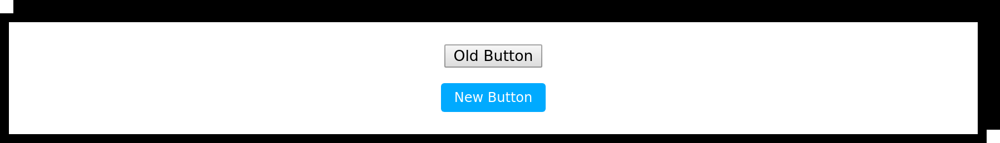
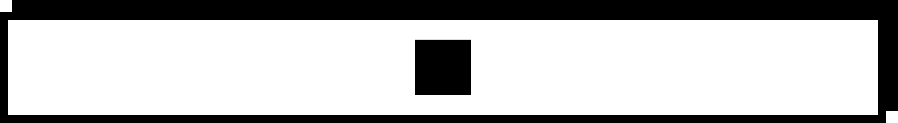

# B ❐ X L

A layout primitive for the [styled component](https://www.styled-components.com) age.

[](https://badge.fury.io/js/boxl)
[](https://travis-ci.com/cremalab/boxl)
[](https://codecov.io/gh/cremalab/boxl)
[](https://opensource.org/licenses/MIT)

## Installation

```shell
$ npm i boxl styled-components
```
>Built with [styled components](https://www.styled-components.com) which is required as a peer dependency

## Usage

>Examples are written in TypeScript

### Define Components

Create components with the `boxl` function passing default props and styling. (All following examples use these components.)

```tsx
// Base.tsx
import { boxl } from "boxl"

interface ParentProps {
  withHeight?: boolean
}

export const Parent = boxl.div<ParentProps>({
  spacing: "14px",
  style: styled => styled`
    height: ${props => props.withHeight 
      ? "449px" 
      : "auto"
    };
    background: white;
    border: 8px solid black;
    box-shadow: 12px -12px 0 0 black;
    margin: 12px 12px 0 0;
    padding: 20px;
  `,
})

interface ChildProps {
  secondary?: boolean
}

export const Child = boxl.div<ChildProps>({
  style: styled => styled`
    background: ${props => 
      props.secondary ? "white" : "black"
    };
    border: 8px solid black;
    color: ${props => 
      props.secondary ? "white" : "black"
    };
    padding: 20px;
  `,
})
```

### Examples

#### `direction: vertical` (default)


```tsx
import React from "react"
import { Child, Parent } from "./Base"

export const Example001 = () => (
  <Parent>
    <Child />
    <Child />
    <Child />
  </Parent>
)
```

#### `direction: horizontal`


```tsx
import React from "react"
import { Child, Parent } from "./Base"

export const Example002 = () => (
  <Parent direction="horizontal">
    <Child grow={1} />
    <Child secondary={true} />
    <Child secondary={true} />
  </Parent>
)
```

## Theme Setup

First, follow [Styled Components](https://www.styled-components.com/docs/api#define-a-theme-interface) instructions on setting up a theme with TypeScript.

Once you have defined a theme, we must annotate `boxl` with it using the provided `Boxl<T>` interface. A common pattern is to re-export the annotated `boxl` function for reuse.

```jsx
import { Boxl, boxl as b } from "boxl"
import { Theme } from "../types/Theme"

export const boxl = b as Boxl<Theme>
```

## API

### `boxl`

`boxl` is a function that returns a `BoxlComponent`. There are two ways to use it:

1. Use predefined element methods: 
```ts
boxl.div(BoxlProps)
```
> Available for all `JSX.IntrinsicElements`
2. Pass a component: 
```ts
boxl(React.ComponentType)(BoxlProps)
```
> `React.ComponentType` is any function or class component

#### Component Example

This allows another component to be passed for styling and is useful when you need to style a 3rd party component (e.g. react-router's `<Link />`).



```tsx
import React, { SFC } from "react";
import { 
  boxl, 
  BoxlComponentProps 
} from "boxl";
import { Parent } from "./Base";

const SomeButton: SFC<BoxlComponentProps> = 
  ({boxlProps, ...props}) => 
    <button {...props} />;

const MyButton = boxl(SomeButton)({
  style: styled => styled`
    background: hsl(200, 100%, 50%);
    border-radius: 0.25em;
    border: none;
    color: white;
    cursor: pointer;
    font-size: 0.75em;
    outline: none;
    padding: 0.5em 1em;
    &:active {
      background: hsl(200, 100%, 40%);
    }
    &:hover {
      background: hsl(200, 100%, 60%);
    }
  `,
})

export const Component001 = () =>
  <Parent alignHorizontal="center">
    <SomeButton>Old Button</SomeButton>
    <MyButton>New Button</MyButton>
  </Parent>
```

### `BoxlProps`

These props may be passed as a default props object or to the returned component itself as JSX props.

>With the exception of `style`, each prop is defined as <a href="BoxlProp">`BoxlProp<A, P, T>`</a>.

---

#### `alignHorizontal` - left | center | right

##### Description

Control horizontal alignment of children. If value is undefined, Child fills available Parent space.

##### Example: `center`



```tsx
// AlignHorizontal.tsx

import React from "react"
import { Child, Parent } from "./Base"

export const AlignHorizontal001 = () =>
  <Parent alignHorizontal="center">
    <Child />
  </Parent>
```

---

#### `alignVertical` - top | center | bottom

##### Description

Aligns children vertically regardless of `direction`.

##### Example: `bottom`


```tsx
// AlignVertical.tsx
import React from "react"
import { Child, Parent } from "./Base"

export const AlignVertical001 = () =>
  <Parent 
    alignVertical="bottom" 
    withHeight={true}
  >
    <Child />
  </Parent>
```
---

#### `childGrow` - number

##### Description

Sets grow amount on all children equally. Useful in combination with `childWrap`.

##### Example

`childGrow={1}` causes Child components to fill available Parent space evenly if possible.


```tsx
// ChildGrow.tsx
import React from "react"
import { Child, Parent } from "./Base"

export const ChildGrow001 = () =>
  <Parent 
    childGrow={1}
    direction="horizontal"
  >
    <Child />
    <Child />
  </Parent>
```
---

#### `childIdealSize` - string (CSS length)

##### Description

Sets `idealSize` on all children. Useful in combination with `childWrap`.

##### Example

`childIdealSize="150px"` causes Child components to _prefer_ 150 pixel width if possible.


```tsx
import React from "react"
import { Child, Parent } from "./Base"

export const ChildIdealSize001 = () =>
  <Parent 
    childIdealSize="150px"
    direction="horizontal" 
  >
    <Child />
    <Child />
    <Child />
    <Child />
  </Parent>
```
---

#### `childWrap` - auto | even

##### Description

Allows Child components to wrap if needed.

##### Example 1: `childWrap="auto"`


```tsx
import React from "react"
import { Child, Parent } from "./Base"

export const ChildWrap001 = () =>
  <Parent
    childIdealSize="200px"
    childWrap="auto"
    direction="horizontal"
    grow={1}
  >
    <Child />
    <Child />
    <Child />
    <Child />
  </Parent>
```

##### Example 2: `childWrap="auto"` with `childGrow={1}`


```tsx
import React from "react"
import { Child, Parent } from "./Base"

export const ChildWrap002 = () =>
  <Parent
    childGrow={1}
    childIdealSize="200px"
    childWrap="auto"
    direction="horizontal"
    grow={1}
  >
    <Child />
    <Child />
    <Child />
    <Child />
  </Parent>
```

##### Example 3: `childWrap="even"` with `childGrow={1}`


```tsx
import React from "react"
import { Child, Parent } from "./Base"

export const ChildWrap003 = () =>
  <Parent
    childGrow={1}
    childIdealSize="200px"
    childWrap="even"
    direction="horizontal"
    grow={1}
  >
    <Child />
    <Child />
    <Child />
    <Child />
  </Parent>
```
---

#### `direction` - vertical | horizontal

##### Description 

Controls the direction that children flow.

##### Example 1: `"vertical"`


```tsx
import React from "react"
import { Child, Parent } from "./Base"

export const Direction001 = () =>
  <Parent direction="vertical">
    <Child />
    <Child />
    <Child />
  </Parent>
```

##### Example 2: `"horizontal"`


```tsx
import React from "react"
import { Child, Parent } from "./Base"

export const Direction002 = () =>
  <Parent direction="horizontal">
    <Child />
    <Child />
    <Child />
  </Parent>
```
---

#### `grow` - number

##### Description 

Determines how the component expands in relation to its parent and siblings.

##### Example


```tsx
import React from "react"
import { Child, Parent } from "./Base"

export const Grow001 = () =>
  <Parent direction="horizontal">
    <Child />
    <Child grow={1} />
    <Child />
  </Parent>
```
---

#### `idealSize` - string (CSS length)

##### Description 

Defines the preferred/ideal width or hight (depending on the parent's `direction`) of the component and may need to be combined with min-/max-/width via the style property to achieve the desired result.

If the parent direction is "vertical" (default), `idealSize` will affect the _height_ of the component. If the parent direction is "horizontal", `idealSize` will affect the _width_ of the component.

##### Example


```tsx
import React from "react"
import { Child, Parent } from "./Base"

export const IdealSize001 = () =>
  <Parent direction="horizontal">
    <Child idealSize="50%" />
  </Parent>
```
---

#### `spacing` - string (CSS length)

##### Description 

Defines the space between children without affecting their distance from the edge of their parent.

##### Example


```tsx
import React from "react"
import { Child, Parent } from "./Base"

export const Spacing001 = () =>
  <Parent 
    childGrow={1} 
    direction="horizontal" 
    spacing="100px"
  >
    <Child />
    <Child />
    <Child />
  </Parent>
```
---

#### `style`: 
- string
- CSSObject
- template literal
- function passed a tagged template literal

##### Description 

Applies style to the component.

##### Example


```tsx
import React from "react"
import { boxl } from "../../lib/boxl"
import { Parent } from "./Base"

const StyleString = boxl.div({
  style: "background: black; border-radius: 10px; height: 50px;",
});

const StyleObject = boxl.div({
  style: {
    background: "black",
    borderRadius: 10,
    height: 50,
  },
})

const TemplateLiteral = boxl.div({
  style: `
    background: black;
    border-radius: 10px;
    height: 50px;
  `,
})

const TaggedTemplateLiteralFn = boxl.div({
  style: styled => styled`
    background: black;
    border-radius: 10px;
    height: 50px;
  `,
})

export const Style001 = () =>
  <Parent>
    <StyleString />
    <StyleObject />
    <TemplateLiteral />
    <TaggedTemplateLiteralFn />
  </Parent>
```
---

### `BoxlProp<A, P, T>`<a name="BoxlProp"></a>

`BoxlProp<A, P, T>` is an interface where parameter `A` is a primitive value (e.g. `"left" | "center" | "right"`), `P` is props, and `T` is theme:

```ts
type BoxlProp<A, P, T> =
  | (A | undefined)
  | (BoxlPropThemeFn<A | undefined, P, T>)
  | (BoxlPropMediaQuery<A | undefined, P, T>);

type BoxlPropThemeFn<A, P, T> = (
  props: BoxlPropsBaseThemed<P, T>
) => BoxlProp<A, P, T>;

type BoxlPropMediaQuery<A, P, T> = {
  [key: string]: BoxlProp<A, P, T>;
};
```
`BoxlProp` is the union of three types:
1. `| (A | undefined)` - a primitive value (or undefined)
2. `| (BoxlPropThemeFn<A | undefined, P, T>)` - a function that receives component props and returns `BoxlProp`
3. `| (BoxlPropMediaQuery<A | undefined, P, T>)` - an object with keys corresponding to a media query string and values that are `BoxlProp`

#### Example Usage:

```tsx
// alignHorizontal as A
const Example01 = boxl.div({
  alignHorizontal: "left"
})

interface Props { 
  foo: boolean 
}

// alignHorizontal as BoxlPropThemeFn
const Example02 = boxl.div<Props>({
  alignHorizontal: props => 
    props.foo ? "left" : "right",
})

// alignHorizontal as BoxlPropMediaQuery
const Example03 = boxl.div<Props>({
  alignHorizontal: { 
    "@media (max-width: 600px)": "left",
    "@media (max-width: 800px)": props => 
      props.foo ? "left" : "center",
  },
})
```

## Develop

- `npm i` install project and test app deps
- `npm start` starts storybook
- `npm test:unit` runs unit tests
- `npm test:visual` runs visual tests (requires storybook to be running e.g. `npm start`)
- `npm test:visual:watch` runs visual tests in watch mode
- `npm run build` compiles `dist/`
- `npm pack` generates `.tgz` for local testing
